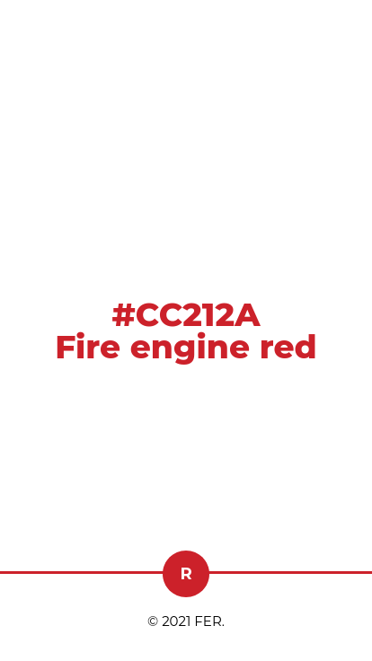
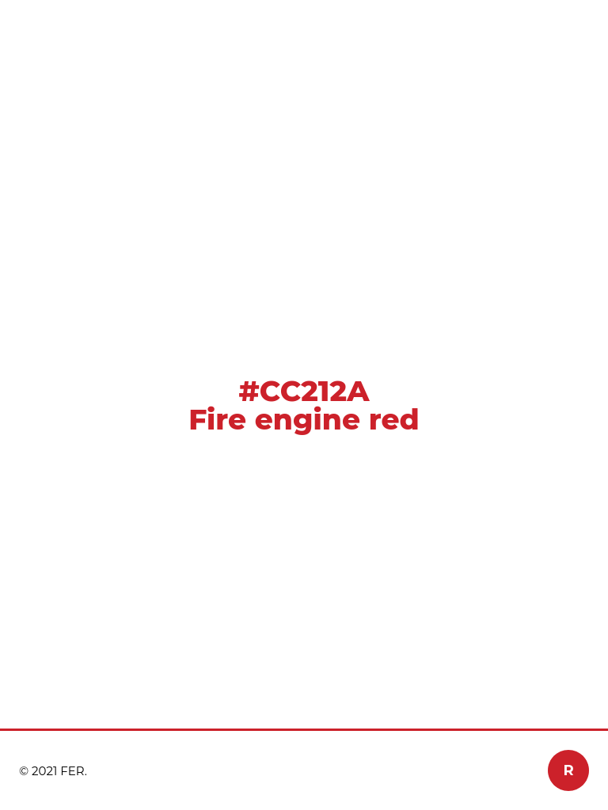

# Repaso Intermedio Módulo 1

## El rojo más perfecto del año

El servicio municipal de bomberos ya no puede soportar más el desprecio de Pantone al no seleccionar su rojo corporativo para su Color of the year.

Para 2021 no están dispuestos a mandar la enésima solicitud y el ayuntamiento ha aprobado el salto digital del servicio de bomberos: van a lanzar una campaña online. ¡A tope!

El primer paso de esta campaña es dar a conocer a la ciudadanía el rojo más perfecto que existe, que además es el color corporativo del orgulloso servicio de bomberos: Fire Red Engine.

Nos ha pedido que hagamos una pequeña landing de presentación del Fire Engine Red. Para ello, el servicio de diseño del ayuntamiento ha preparado unas pantallas, y nosotras vamos a realizar la maquetación responsive.

La landing, siguiendo un estilo minimal constará de un cuerpo que ocupe el alto de la pantalla y en su centro muestre el código hexadecimal (#CC212A) y el nombre el rojo más perfecto, el Fire Red Engine. Por supuesto usando dicho color para la fuente y contrastando con el blanco digital más puro.

Acompañando a esta página tendremos un pie fijo a la ventana del navegador mostrando la que será la futura marca de dicho color.

Estas son las pantallas:

> Versión mobile

> Versión tablet/desktop

## Guía de pasos para solucionarlo

1. Leer el enunciado.
2. Crear el repositorio.
3. Clonar el repositorio.
4. Crear la estructura de ficheros.
5. Haz tu primer `git add .`, `git commit`, `git push`.
6. Crea tu github pages .
7. Crea la estructura semántica del HTML.
8. Crea las etiquetas semánticas en el HTML.
9. Agrega la hojas de estilo `reset.css`.
10. Agrega la hojas de estilo `main.css`.
11. Crea los estilos para formato movil
12. Crea los estilos en formato `tablet/desktop`.
