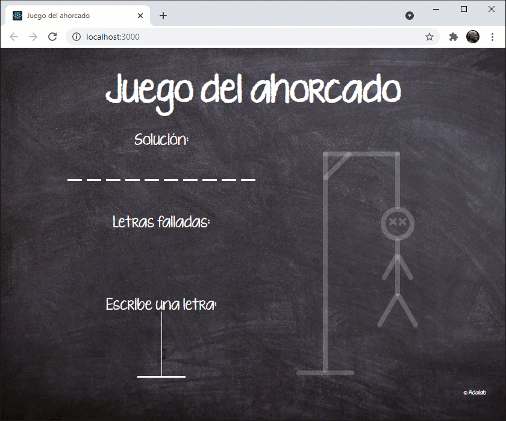

## Ejercicio para el pair programming

Por petición de alumnas de promociones pasadas, hemos creado un ejercicio para que puedas programarlo día a día con tu pareja durante el horario de pair programming.

En estos materiales encontraréis el enunciado de las tareas que debéis hacer cada día.

Es obligatorio que lo hagáis en la hora de pair programming porque:

- Aquí os enseñamos trucos y buenas prácticas.
- Cuando a mitad de módulo cambies de pareja tendrás que seguir trabajando sobre tu ejercicio o el de tu nueva pareja.

## Enunciado del ejercicio (primera parte)

Todo el mundo sabe cómo se juega al ahorcado, pero aún así vamos a especificar lo que debemos hacer en el ejercicio. Os contamos lo que haremos en la primera parte del módulo. Cuando lleguemos a la lección del **Router** os contaremos la segunda parte.

1. Al arrancar la página, el juego debe obtener una palabra aleatoria de una API. Esta palabra es la que la jugadora debe adivinar.
   1. Una vez la API nos devuelve la palabra aleatoria debemos pintar en el apartado **Solución** varios guiones bajos para indicar a la jugadora la longitud de la palabra que debe adivinar.
1. Cuando la usuaria escriba una letra en **Escribe una letra** tendremos que:
   1. Actualizar la **Solución**:
      - Si la letra escrita por la jugadora está entre las letras de la palabra buscada debemos mostrar las letras acertadas encima de los guiones correspondientes.
   1. Actualizar **Las letras falladas**:
      - Si la letra escrita por la jugadora no está entre las letras de la palabra buscada debemos pintarla en este apartado.
   1. Actualizar el ahorcado:
      - Si la letra escrita por la jugadora no está entre las letras de la palabra buscada debemos actualizar el CSS del ahorcado para que las líneas se pongan blancas.
